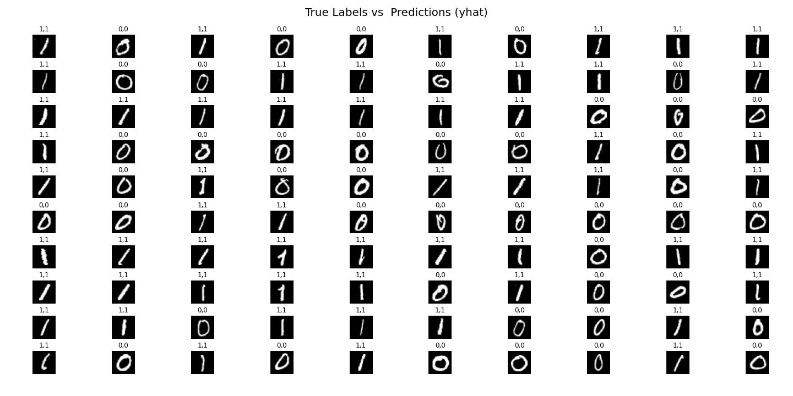

# Binary Handwritten Digit Recognition

See complete model selection and analysis [- Link](https://github.com/giomvp/AcademicProjects/blob/d5ac7371ee69286f91de43ad8e50921057fdcf26/BinaryDigitRecognition/BinaryDigitRecognition.ipynb).

## 1. Problem Statement

The objective of this project is to develop a robust machine learning model capable of accurately recognizing and classifying handwritten digits as either 0 (zero) or 1 (one) from image data. This is a binary classification task, where the model must learn to distinguish between the two digit classes based on the provided training examples.

The problem addresses the challenge of interpreting and classifying handwritten digits, which can vary significantly in terms of style, thickness, and orientation. The model must be able to extract relevant features from the input images and learn the underlying patterns that differentiate between the two digit classes.

Successful completion of this project will demonstrate proficiency in applying machine learning techniques, specifically neural networks, to solve a real-world binary classification problem involving image data. The insights gained from this project can be extended to other applications involving image recognition and classification tasks.

## 2. Data Description

The data set contains 8817 training examples of handwritten digits, limited to zero and one. Each training example is a 28-pixel x 28-pixel grayscale image of the digit. 

* Number of observations  - 8817
* Number of variables/columns - 784 (all numeric values)
* Column 1 is the target value (lebel)

## 3. Modelling Algorithms

Tensorflow - Keras (api): 

  * Model: Sequential - Dense
  * Loss: BinaryCrossentropy
  * Optimizer: Adam

* Metric - As the target variable is categorical, accurracy_score, f1_socre, precision_socre, and recall_score were used.

## 4. Results

The model achieved exceptional performance on both the training and test datasets, with an accuracy of 0.999 and near-perfect F1 scores, precision, and recall values. These metrics indicate that the model is highly accurate in classifying handwritten digits as 0 or 1, with minimal misclassifications.

> Train data set ->  Accuracy: 0.999   |   F1 score: 0.999    |    Precision: 0.999    |   Recall: 1.000

> Test data set  ->  Accuracy: 0.999   |   F1 score: 0.999    |    Precision: 0.999    |   Recall: 0.998

Overall, the developed Keras NN is a highly accurate machine learning model capable of classifying handwritten digits as 0 or 1. The model's exceptional performance on both the training and test datasets, as well as the low number of misclassifications observed in the confusion matrices, demonstrate the effectiveness of the applied techniques and algorithms.

<!--  -->

