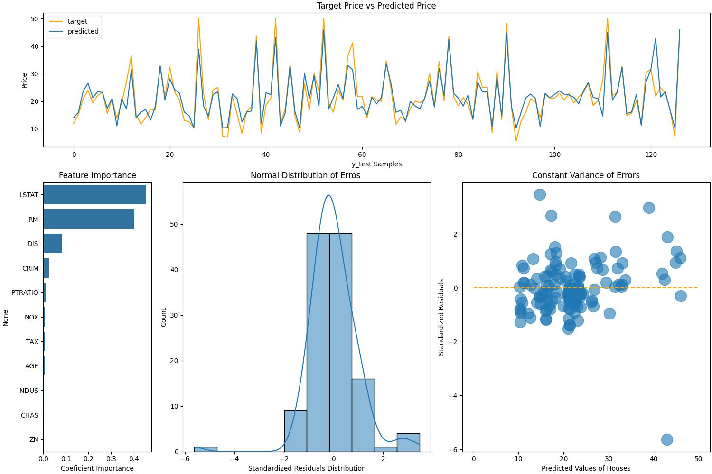

# Boston House Price Prediction

See complete model selection and analysis - [link](BostonHousePricePrediction.ipynb)

## 1. Problem Statement

The objective of this project is to develop a machine learning model capable of predicting the median value of owner-occupied homes in the Boston area. The model will leverage various features describing the locality, such as crime rates, accessibility to amenities, and demographic data, to provide reliable price estimates for residential properties.

The problem addresses the challenge of understanding the complex interplay between multiple factors that influence housing prices in a given area. The model must learn to identify and quantify the impact of these features on property values, enabling accurate predictions that can assist homebuyers, real estate professionals, and urban planners in making informed decisions.

This project demonstrates proficiency in applying machine learning techniques to solve a real-world regression problem involving multiple features and complex relationships. The insights gained from this project can be extended to other applications involving property valuation, urban planning, and real estate analytics.

## 2. Data Description

Each record in the database describes a Boston suburb or town. The data was drawn from the Boston Standard Metropolitan Statistical Area (SMSA) in 1970. Detailed attribute information can be found below.

* Number of instances  - 506
* Number of Attributes - 13 (12 inputs, 1 output)

## 3. Modelling Algorithms

Algorithms were selected following scikit-learn algorithm cheat-sheet

  * Ridge regression
  * SVR (linear)
  * SVR (rbf)
  * Xgbregressor
  * Random Forests

**Metric** - Since the target variable is a continuous variable, regression evaluation metric RMSE (Root Mean Squared Error) and R2 Score (Coefficient of Determination) have been used.

## 4. Results

The **Random Forest (RF)** model demonstrated good and consistent performance in predicting housing prices based on the given features. The model's ability to explain the variability in prices and make accurate predictions was evaluated using several metrics.

Coefficient of Determination (R-squared):

* On the training dataset, it explains 91% of the variability in housing prices based on the independent variables (features) used.
* On the test dataset, it can explain 84% of the variability in housing prices for unseen data.

**Cross-Validation Accuracy (R-squared):** measured by the R-squared score, was 0.84 with a standard deviation of 0.04. This metric evaluates the model's performance using k-fold cross-validation, providing a more robust estimation of its generalization ability.

Overall, the model demonstrated strong performance in predicting housing prices, with an R-squared score of 0.84 on the test dataset and a MAPE of 14%. The model effectively captured the relationship between the independent variables (features) and the target variable (housing prices), making it a suitable choice for this regression problem.

Metrics:

* Train data set ->  r2_score: 0.91  |    mse: 7.15   |  rmse: 2.67  |   mae: 2.08 |   mape: 0.11
* Test data set  ->  r2_score: 0.84  |    mse: 13.93  |  rmse: 3.73  |   mae: 2.55 |   mape: 0.14
* Cross Validation Accurracy (r2_score): 0.84 (+/- 0.04)

In summary, the Random Forest (RF) model achieved excellent results in predicting Boston housing prices, showcasing its ability to handle complex relationships between multiple features and the target variable. The high R-squared scores, low error rates, and robust cross-validation performance highlight the model's effectiveness and generalization capabilities, making it a promising solution for this regression task.

