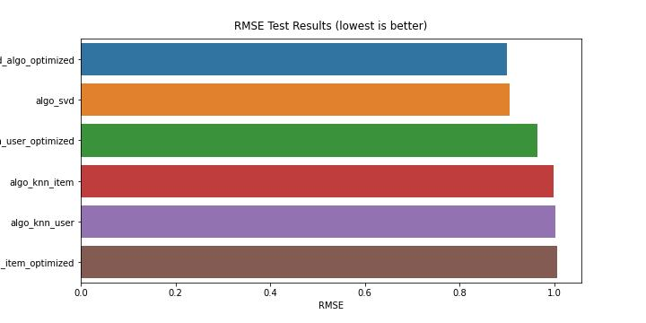

# Movie Recommendations

See complete model selection and analysis - [Link](MovieRecommendations.ipynb)

## 1. Problem Statement

This project is to develop an intelligent and personalized movie recommendation system that suggests relevant and engaging movies to users based on their historical interactions, preferences, and the collective behavior of other users.

The problem addresses the challenge of providing tailored and context-aware recommendations in the vast and ever-growing domain of movies. The recommendation system must learn to understand each user's unique tastes and interests, as well as identify patterns and similarities among users, to deliver recommendations that maximize user satisfaction and engagement.

## 2. Data Description

The ratings dataset contains the following attributes:

* Number of observations  - 100004
* Number of variables/columns - 4 (all numeric values )
* nulls - 0

## 3. Modelling Algorithms

* Knowledge/Rank based recommendation system
* User Similarity-Based Collaborative filtering
* Item Similarity-Based Collaborative filtering
* Matrix Factorization Based Collaborative Filtering

*Metrics* - As the target variable is categorical, accurracy_score, f1_socre, precision_socre, and recall_score were used.

## 4. Results

The project aimed to develop an effective movie recommendation system, and several models and approaches were explored. The results suggest that the Singular Value Decomposition (SVD) algorithm, specifically the svd_algo_optimized model (tuned hyperparameters) , performed the best for this dataset.

Performance Metrics for svd_algo_optimized:

* Root Mean Squared Error (RMSE): The model achieved an RMSE of 0.899653, which indicates a relatively low error rate in predicting the ratings for user-movie pairs.
* Precision and Recall: When considering the top 10 recommendations (K = 10), the model demonstrated a precision of 0.732 and a recall of 0.526. These metrics evaluate the model's ability to recommend relevant and accurate movies among the top recommendations.

Overall, the project successfully implemented and evaluated different recommendation algorithms, identifying the svd_algo_optimized model as the best performer for the given dataset. The combination of the SVD model and the Rank-Based Recommendation System provides a robust solution for delivering personalized movie recommendations to both existing and new users.

