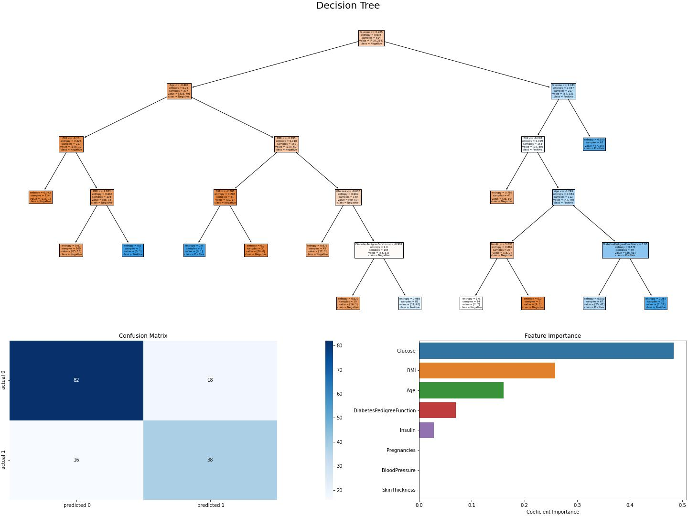

# Pima Indians Diabetes Analysis

See complete model selection and analysis - [Link](PimaIndiansDiabetesAnalysis.ipynb)

## 1. Problem Statement

The problem addresses the challenge of early detection and preventive healthcare measures for a population with a higher prevalence of diabetes. By analyzing the medical data and building a predictive model, this project aims to provide a valuable tool to healthcare professionals.

 This project contributes to the understanding of diabetes within the Pima Indian community but also demonstrate proficiency in applying machine learning techniques to solve a real-world classification problem involving medical data. The insights gained from this project can be extended to other healthcare applications, aiding in early detection, preventive measures, and personalized treatment plans.

## 2. Data Description

Research was done on a tribe in America which is called the Pima tribe (also known as the Pima Indians). In this tribe, it was found that the ladies are prone to diabetes very early. Several constraints were placed on the selection of these instances from a larger database. All patients were females at least 21 years old of Pima Indian heritage. 

* Number of observations  - 768
* Number of variables/columns - 9 (all numeric interger values )
* nulls - 0

## 3. Modelling Algorithms

  - a. K-Nearest Neighbords Classifier
  - b. Linear Support Vector Machine Classifier
  - c. Random Forest Classifier
  - d. Decision Tree Classifier

*Metrics* - As the target variable is categorical, accurracy_score, f1_socre, precision_socre, and recall_score were used.

## 4. Results

The Decision Tree Classifier (dct) model demonstrated acceptable performance on the Pima Indians Diabetes dataset. The model's effectiveness was evaluated using various metrics on both the training and test datasets, as well as through k-fold cross-validation.

* Train data set ->  Accuracy: 0.814   |   F1 score: 0.749    |    Precision: 0.708    |   Recall: 0.794
* Test data set  ->  Accuracy: 0.779   |   F1 score: 0.691    |    Precision: 0.679    |   Recall: 0.704
* Cross Validation Accuracy: 0.716 (+/- 0.030) [DecisionTreeClassifier]

This **Accuracy** factor shows the model is able to predict 72% of observations. A Precision and Recall of also 70 aprox., indicate this model is correctly classifying labels at a good ratio.

**Predictors Glucose, BMI, and Age** are the most significant variables to predict Diabetes given this set of values.

While the Decision Tree Classifier (dct) model demonstrated acceptable performance, there is room for improvement. The accuracy, precision, and recall metrics indicate that the model is correctly classifying a reasonable proportion of instances, but further refinement or exploration of alternative models could potentially enhance the predictive performance.

Find below some charts to ilustrate de results:

a. Decision Tree 
b. Confusion Matrix
c. Feature Importance

